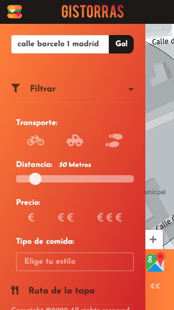
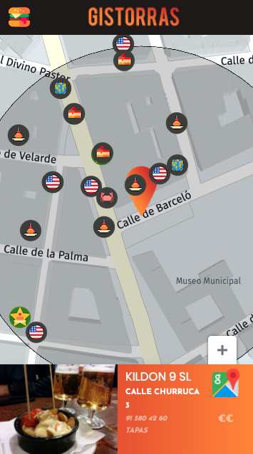

<h1 align="center"><code>🗺 🌭 Gistorras</code></h1>

    
        <h2>👉 To visit the website click <a href="https://vdedios.github.io/chistorraMaps/" target="_blank">here!</a></h2>
    

    <h3 align="center">Desktop version</h3>
    </img>
    <h3 align="center">Mobile version</h3>
    

    </img>
    </img>
    

## What's all this?

  
Gistorras is a useful tool for quickly finding where to eat near you!

  
It was made for 42Madrid Map-HAckaton using Here APIs and services

## Features
<ul style="list-style: none;">
  <li>Map integration with HERE api</li>
  <li>Isolines calculation</li>
  <li>Info filtering</li>
  <li>Rounting redirection</li>
  <li>Geo tracking</li>
</ul>

## Instructions

  
Just click enter the site and it will automatically track your geo localization in order to show you the nearest places to eat. You then can filter the info between several options or set other addresses.

  
If you don't consent using your location you still can use the builtin search box.

